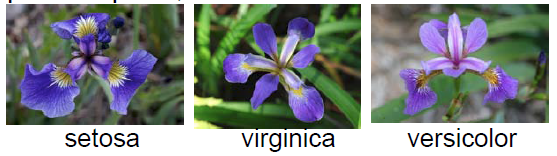
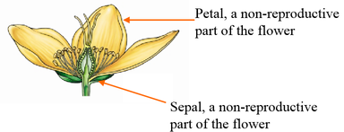

Explore Iris Dataset
========================================================


Iris dataset - Introduction
--------------
The dataset consists of 50 samples from each of three species of Iris flowers (Iris setosa, Iris virginicaand Iris versicolor). Four features(variables) were measured from each sample, they are the **length** and the **width** of sepal and petal, in centimeters. It is introduced by Sir Ronald Fisher in 1936.

### 3 Species


### Flower Parts


Explore the *iris* Dataset with R
------------------------------------

### Load Data
The *iris* flower data set is included in R. It is a data frame with 150 cases (rows) and 5 variables (columns) named Sepal.Length, Sepal.Width, Petal.Length, Petal.Width, and Species.

First, load iris data to the current workspace
 
```{r}
data(iris)
```

### What is in the dataset?
You can use `head()` or `tail` to print the first or last few rows of a dataset:
```{r}
head(iris)
```

Check dimensionality, the dataset has 150 rows(observations) and 5 columns (variables)
```{r dim}
dim(iris)
```

Another way to get the dim is to use ncol or nrow:
```{r}
ncol(iris)
nrow(iris)
```


 Variable names or column names
```{r varname}
names(iris)
```

You can also use this command
```{r, eval=FALSE}
colnames(iris)
```


 Structure of the dataframe, note that the difference between *num* and *Factor*
```{r struc}
str(iris)
```

By default, R treat strings as factors (or categorical variables), in many situations  (for example, building a regression model) this is what you want because R can automatically create "dummy variables" from the factors. However when merging data from different sources this can cause errors. In this case you can use `stringsAsFactors = FALSE` option in `read.table`.

### Subsetting the Dataset I: Numerical Index and Variable Names
 Get the first 5 rows/obs
```{r first5}
iris[1:5,]
```

 Get Sepal.Length of the first 10 rows
```{r}
iris[1:10, "Sepal.Length"]
```
or alternatively
```{r }
iris$Sepal.Length[1:10]
```
or you can use the column index instead of variable names. Since Sepal.Length is the first column:
```{r}
iris[1:10, 1]
```

### Subsetting the Dataset II: Logical Conditions
There are 3 ways to get subsets of data that satisfy certain logical conditions. These kind of operations are called filtering in Excel. Knowing any one of these well is enough. Do not worry about memorizing the syntax, you can always look them up.

Suppose we want to get the **observations that have Sepal.Length > 5 and Sepal.Width > 4**.

#### Logical operators
!=  not equal to

==  equal to

|  or

& and

#### Use subset function
```{r, eval=FALSE}
subset(x = iris, subset = Sepal.Length > 5 & Sepal.Width > 4)
```
You can omit the x = and subset = part
```{r eval=FALSE}
subset(iris, Sepal.Length > 5 & Sepal.Width > 4)
```

#### Use logical vectors
```{r}
iris[(iris$Sepal.Length > 5 & iris$Sepal.Width > 4), ]
```


#### Use SQL statement
```{r, eval=FALSE}
install.packages('sqldf')
library(sqldf)
sqldf('select * from iris where `Sepal.Length` > 5 and `Sepal.Width` > 4')
```
In earlier version of sqldf all dots(.) in variable names need to be changed to underscores(_). 

### Subsetting the Dataset III: Random Sample
The following code random sample (without replacement) 90% of the original dataset and assgin them to a new variable *iris_sample*. 
```{r}
iris_sample = iris[sample(x = nrow(iris), size = nrow(iris)*0.90),]
```

The `dplyr` package provides more convinient ways for generating random samples. You can take a fixed number of samples using `sample_n()` or a fraction using `sample_frac()` as follows
```{r, eval=FALSE}
install.packages('dplyr')
library(dplyr)
iris_sample = sample_frac(iris, 0.9)
```


The `dplyr` package provides more convinient ways for generating random samples. You can take a fixed number of samples using `sample_n()` or a fraction using `sample_frac()` as follows
```{r, eval=FALSE}
install.packages('dplyr')
library(dplyr)
iris_sample = sample_frac(iris, 0.9)
# using dplyr for logical subsetting
filter(iris, Sepal.Length> 5, Sepal.Width > 4)
```
I recommend you to go through the [`dplyr` tutorial](https://cran.rstudio.com/web/packages/dplyr/vignettes/introduction.html) and [lubridate tutorial](http://vita.had.co.nz/papers/lubridate.html). They make common data manipulation tasks and dealing with time-date much easier in R.


### Sorting
Sorting by one or more variables is a common operation that you can do with datasets. With RStudio version 0.99+, you can sort a dataset when viewing it by clicking column header. 

To do it with code, let's suppose that you would like to find the top 5 rows in `iris` dataset with largest `Sepal.Length`.

```{r}
iris[order(iris$Sepal.Length, decreasing = TRUE)[1:5], ] 
```

The syntax is cleaner with the `arrange()` function in the `dplyr` package:
```{r, eval=FALSE}
arrange(iris, desc(Sepal.Length))[1:5, ]
```


### Summary Statistics and Plots

Summary statistics of every variable
```{r}
summary(iris)
```

Frequency of species
```{r}
table(iris$Species)
```

Pie Chart
```{r}
pie(table(iris$Species))
```

Plot histogram and density plot of Sepal.length
```{r}
hist(iris$Sepal.Length)
plot(density(iris$Sepal.Length))
```

Scatter plot of length and width of sepals
```{r}
plot(iris$Sepal.Length, iris$Sepal.Width)
```

Parallel Coordinates
```{r}
library(MASS)
parcoord(iris[,1:4],col=iris$Species)
```


Chernoff faces of the first 20 obs
```{r, eval=FALSE}
install.packages("aplpack")
```
```{r, results='hide', warning=FALSE}
library(aplpack)
```

```{r}
faces(iris[1:20,1:4],main="Faces for Iris Data",label=iris$Species[1:20])
```


### Cluster Analysis
#### K-means clustering
K-means clustering with 5 clusters, the 'fpc' package provides the 'plotcluster' function. You need to run `install.packages('fpc')` to install it first.

```{r, eval=FALSE}
install.packages("fpc")
```


```{r results='hide',message=FALSE,warning=FALSE}
library(fpc)
```

```{r}
fit = kmeans(iris[,1:4], 5)
plotcluster(iris[,1:4], fit$cluster)
```
The first argument of the kmeans function is the dataset that you wish to cluster, that is the column 1-4 in the iris dataset, the last column is true category the observation so we do not include it in the analysis; the second argument 5 indicates that you want a 5-cluster solution. The result of the cluster analysis is then assigned to the variable fit, and the plotcluster function is used to visualize the result.

Do you think it is a good solution? Try it with 3 cluster.
```{r}
kmeans_result = kmeans(iris[,1:4], 3)
plotcluster(iris[,1:4], kmeans_result$cluster)
```

#### Hierarchical clustering
```{r}
hc_result = hclust(dist(iris[,1:4]))
plot(hc_result)
#Cut Dendrogram into 3 Clusters
rect.hclust(hc_result, k=3)
```

3 things happened in the first line. First dist(iris[, 1:4]) calculates the distance matrix between observations (how similar the observations are from each other judging from the 4 numerical variables). Then hclust takes the distance matrix as input and gives a hierarchical cluster solution. At last the solution is assigned to the variable hc_result. In hierarchical clustering you do not need to give the number of how many clusters you want, it depends on how you cut the dendrogram. 

